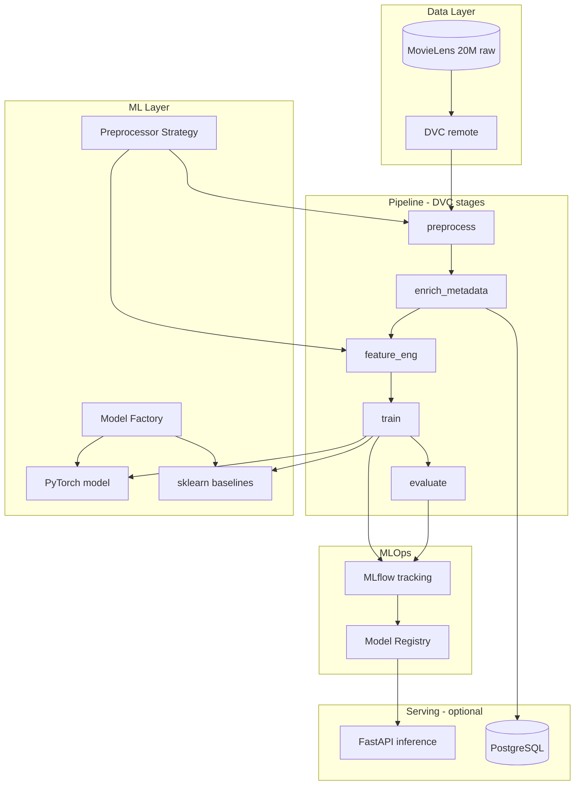

# Architecture Overview

## System Summary

**Project:** FIAP Tech Challenge 02 — MovieLens 20M Recommendation System  
**Style:** Layered Clean Architecture + batch MLOps pipeline  
**Primary workload:** Offline training and evaluation; optional FastAPI for inference  

Personalized movie recommendations from collaborative filtering (PyTorch embeddings/MLP) enriched with content features (tags, optional BERTopic, optional TMDB metadata).

## High-Level Flow

**End-to-end:** raw data → preprocess → feature engineering → train → evaluate → registry → inference

## Layer Responsibilities

| Layer | Path | Responsibility |
|-------|------|----------------|
| **Domain** | `src/domain/` | Entities: UserId, MovieId, Rating, RecommendationList |
| **Data** | `src/data/` | Loaders, DVC stage scripts, preprocess Strategies |
| **Features** | `src/features/` | Matrices, encoders, BERTopic, content embeddings |
| **Models** | `src/models/` | PyTorch modules, sklearn baselines, **Factory** |
| **Training** | `src/training/` | Loops, seeds, checkpointing, MLflow logging |
| **Evaluation** | `src/evaluation/` | Recall@K, Precision@K, NDCG@K, RMSE |
| **Serving** | `src/serving/` | Batch recommend + optional FastAPI |
| **Configs** | `configs/` | YAML hyperparameters, paths |
| **Infra** | `docker/`, `dvc.yaml` | Reproducible environment |

## Design Patterns

### Factory (models)

Instantiate recommender implementations without coupling callers to concrete classes:

- `TorchEmbeddingRecommender`
- `TorchMLPRecommender`
- `SklearnBaselineRecommender`

### Strategy (preprocessing)

Swap preprocessing behavior via configuration:

- Explicit vs implicit feedback
- Temporal split vs random split
- Filter already-seen items for training negatives

## Model Architecture (PyTorch)

- **Collaborative:** `nn.Embedding` for `userId` and `movieId` + dot product or MLP on concatenated embeddings  
- **Hybrid:** concatenate content vector (tags/BERTopic/TMDB) to item side  
- **Training:** mini-batch BPR / MSE on ratings; early stopping on validation NDCG@K  

## PostgreSQL Role

PostgreSQL is **not** the training source of truth. Use it for:

- Cached TMDB/metadata tables after `enrich_metadata`
- Optional serving catalog and audit logs

**Source of truth for experiments:** DVC artifacts + MLflow runs.

## Scalability & Reliability

- **Batch-first:** preprocess and feature_eng scale with Pandas/PyTorch DataLoader  
- **20M ratings:** avoid loading full CSV in memory where possible; use chunked reads or subset for dev  
- **Failure handling:** DVC stage retries; MLflow logs failed runs; Docker reproducible builds  
- **No real-time requirement** in MVP (batch inference acceptable)

## Observability

- MLflow: params, metrics, artifacts per run  
- Structured logging (JSON) in training scripts  
- Model Card documenting metrics, bias, cold-start limitations  

## Security Boundaries

- Secrets via `.env` only (`TMDB_API_KEY`, `DATABASE_URL`, DVC remote credentials)  
- No PII beyond anonymized MovieLens IDs in logs  

## Related Documentation

- `.cursor/context/tech-stack.md`
- `.cursor/context/ml-pipeline.md`
- `.cursor/context/deployment.md`
- `.cursor/context/project-goals.md`
- `.cursor/rules/business-rules.md`
