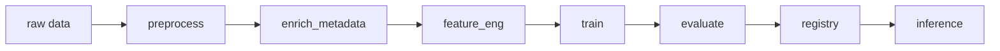

# ML Pipeline (DVC + MLflow)

## Objective

Single source of truth for the recommendation pipeline stages, artifacts, and experiments.

## Dataset (MovieLens 20M)

| File | Role |
|------|------|
| `ratings.csv` | userId, movieId, rating, timestamp |
| `movies.csv` | movieId, title, genres |
| `tags.csv` | user-generated tags (aggregate per movie for NLP) |
| `links.csv` | movieId → imdbId, tmdbId |
| `genome-scores.csv` | Content similarity signals |

**E-commerce analogy:** user → customer, movie → SKU, rating → engagement signal.

## DVC Stages (minimum 3; recommended 5)

| Stage | Inputs | Outputs |
|-------|--------|---------|
| `preprocess` | ratings, movies, tags | temporal splits, implicit feedback, cleaned IDs |
| `enrich_metadata` | links.csv + TMDB cache | `data/processed/movie_metadata.parquet` |
| `feature_eng` | metadata, tags, genome | user-item matrix, content vectors, BERTopic (optional) |
| `train` | features | PyTorch checkpoint, sklearn baselines |
| `evaluate` | model + test split | Recall@K, Precision@K, NDCG@K, RMSE |
| `registry` | best run | MLflow Model Registry Staging → Production |
| `inference` | Production model | top-K recommendations (batch or API) |

## Reproducibility Checklist

- Fixed random seeds (`PYTHONHASHSEED`, `torch`, `numpy`, `random`)
- `params.yaml` / `configs/` versioned with code
- DVC tracks data hashes; no raw 20M in Git
- TMDB metadata fetched once, cached under DVC (not on every `dvc repro`)

## MLflow Ablation (≥ 4 runs)

1. Collaborative only (user + item embeddings)
2. + MovieLens tags
3. + BERTopic on aggregated tags
4. + TMDB metadata (`enrich_metadata`)

Log: hyperparameters, metrics, model artifact, feature schema hash.

## Design Patterns

| Pattern | Location |
|---------|----------|
| **Factory** | `src/models/factory.py` — PyTorch vs sklearn baselines |
| **Strategy** | `src/data/preprocessors/` — explicit vs implicit feedback, filters |

## Related Documentation

- `.cursor/context/architecture.md`
- `.cursor/context/deployment.md`
- `TODO.md` (execution plan)
