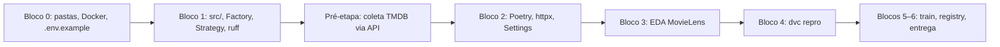
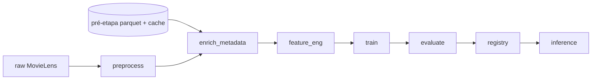

# ML Pipeline (DVC + MLflow)

## Objective

Single source of truth for the recommendation pipeline stages, artifacts, experiments, and **human execution order** (see `TODO.md`).

## Human execution order (project blocks)

The PDF stages map to repo work in this order. **TMDB collection is not the first step.**

| Phase | When | Delivers |
|-------|------|----------|
| **Bloco 0** | First | `src/`, `tests/`, `data/`, `scripts/`, `configs/`, `.gitignore`, Docker skeleton |
| **Bloco 1** (Etapa 1 PDF) | After Bloco 0 | Clean code: `src/data/`, lint, Factory/Strategy stubs, tests |
| **Pré-etapa** | **After Bloco 1** | One-time TMDB fetch → `data/raw/external_metadata/` + `data/processed/movie_metadata.parquet` |
| **Bloco 2** (Etapa 2 PDF) | Parallel or right after pré-etapa | `pyproject.toml`, `httpx`, Pydantic Settings (`TMDB_API_KEY`) |
| **Bloco 4+** | When DVC exists | `dvc repro` — stages below; **no live TMDB calls** |

**Pré-etapa vs DVC:** the pré-etapa is a **manual/CLI batch job** (`src/data/external/tmdb_client.py` + `scripts/fetch_external_metadata.py`) run once (or when refreshing metadata). The DVC stage `enrich_metadata` **consumes** that cache/parquet and normalizes joins — it must not call the TMDB API on every `dvc repro`.

**Prerequisites for pré-etapa:** Blocos 0–1 done; Bloco 2.1–2.4 recommended (`httpx` + Settings) or temporary `pip install httpx` until Poetry is locked.

## Dataset (MovieLens 20M)

| File | Role |
|------|------|
| `ratings.csv` | userId, movieId, rating, timestamp |
| `movies.csv` | movieId, title, genres |
| `tags.csv` | user-generated tags (aggregate per movie for NLP) |
| `links.csv` | movieId → imdbId, tmdbId |
| `genome-scores.csv` | Content similarity signals |

**E-commerce analogy:** user → customer, movie → SKU, rating → engagement signal.

## DVC Stages (minimum 3; recommended 5+)

Runs in **Bloco 4**, after pré-etapa artifacts exist and Bloco 2 deps are installed.

| Stage | Inputs | Outputs | API calls on `dvc repro` |
|-------|--------|---------|---------------------------|
| `preprocess` | ratings, movies, tags | temporal splits, implicit feedback, cleaned IDs | No |
| `enrich_metadata` | `links.csv` + **`movie_metadata.parquet` / `data/raw/external_metadata/`** (from pré-etapa) | validated `data/processed/movie_metadata.parquet` | **No** — join/validate only |
| `feature_eng` | metadata, tags, genome | user-item matrix, content vectors, BERTopic (optional) | No |
| `train` | features | PyTorch checkpoint, sklearn baselines | No |
| `evaluate` | model + test split | Recall@K, Precision@K, NDCG@K, RMSE | No |
| `registry` | best run | MLflow Model Registry Staging → Production | No |
| `inference` | Production model | top-K recommendations (batch or API) | No |

### `enrich_metadata` behavior

1. **Before Bloco 4:** pré-etapa (post Etapa 1) populates TMDB cache via API.  
2. **On `dvc repro`:** read cache/parquet; align `movieId` ↔ `tmdbId`; drop or flag invalid links; never hit TMDB.  
3. **Missing pré-etapa output:** stage fails with a clear message pointing to `docs/PRE_ETAPA_METADADOS.md`, not a silent API fetch.

## Reproducibility Checklist

- Fixed random seeds (`PYTHONHASHSEED`, `torch`, `numpy`, `random`)
- `params.yaml` / `configs/` versioned with code
- DVC tracks data hashes; no raw 20M in Git
- TMDB: fetch in **pré-etapa** (after Bloco 1); version `movie_metadata.parquet` + raw cache with DVC in Bloco 4 — **never** on every `dvc repro`

## MLflow Ablation (≥ 4 runs)

1. Collaborative only (user + item embeddings)
2. + MovieLens tags
3. + BERTopic on aggregated tags
4. + TMDB metadata (features from pré-etapa / `enrich_metadata` join)

Log: hyperparameters, metrics, model artifact, feature schema hash.

## Design Patterns

| Pattern | Location |
|---------|----------|
| **Factory** | `src/models/factory.py` — PyTorch vs sklearn baselines |
| **Strategy** | `src/data/preprocessors/` — explicit vs implicit feedback, filters |

## Related Documentation

- `TODO.md` — block order, pré-etapa tasks (P.1–P.11), checkpoints
- `docs/PRE_ETAPA_METADADOS.md` — one-time TMDB collection runbook (created in pré-etapa)
- `.cursor/context/architecture.md`
- `.cursor/context/deployment.md`
