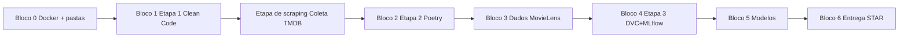

# Tech Challenge Fase 02 — Plano de Execução

> Projeto: sistema de recomendação com **MovieLens 20M**, **PyTorch**, **Docker**, **DVC**, **MLflow** e **BERTopic** (engenharia de features).
>
> Equipe: 4 participantes — trocar **A / B / C / D** pelos nomes reais.
>
> **Começar por:** [Bloco 0 — Fundação e Docker inicial](#bloco-0--fundação-e-docker-inicial), depois [Etapa 1 — Clean Code](#bloco-1--etapa-1-clean-code-disciplina-01). A [coleta TMDB](#etapa-de-scraping--coleta-de-metadados-imdbtmdb-após-etapa-1--clean-code) fica **após** a Etapa 1 (estrutura `src/` pronta).

---

## Visão geral do desafio

| Item | Detalhe |
|------|---------|
| **Nota** | 90% da fase (obrigatório, em grupo) |
| **Entrega obrigatória** | Repositório GitHub + vídeo STAR (≤ 5 min) |
| **Entrega opcional** | Deploy em nuvem (+5% bônus) |
| **Problema (enunciado)** | Sistema de recomendação para e-commerce por comportamento de navegação |
| **Modelo central** | Rede neural PyTorch (MLP ou embedding-based) |
| **Stack obrigatória** | PyTorch, Scikit-Learn, MLflow, DVC, Docker, Poetry/uv, clean code |
| **Dataset** | [MovieLens 20M](https://www.kaggle.com/datasets/grouplens/movielens-20m-dataset) |

---

## Adaptação MovieLens → e-commerce

| MovieLens | Analogia e-commerce |
|-----------|---------------------|
| `userId` | Cliente |
| `movieId` | Produto (SKU) |
| `rating` / timestamp | Interação / engajamento |
| `tags` (texto) | Tags de navegação / descrições |
| `genome-scores` | Atributos de produto |
| `links.csv` (`imdbId`, `tmdbId`) | Link para catálogo externo (ficha rica do “produto”) |

O PDF aceita MovieLens explicitamente (≥ 10.000 interações user–item; o 20M atende com folga).

---

## Enriquecimento com `links.csv` (IMDb / TMDB)

O arquivo `links.csv` mapeia cada `movieId` para IDs externos:

```csv
movieId,imdbId,tmdbId
1,0114709,862
```

| Campo | Exemplo | URL |
|-------|---------|-----|
| `imdbId` | `0114709` | `https://www.imdb.com/title/tt0114709/` |
| `tmdbId` | `862` | `https://www.themoviedb.org/movie/862` |

> O README oficial do MovieLens avisa que esses IDs **não foram validados** pelo GroupLens — tratar inconsistências no `preprocess` (filmes sem link, IDs inválidos).

### Por que isso melhora o modelo?

Hoje vocês têm principalmente **sinal colaborativo** (ratings) e **gêneros** (`movies.csv`). Metadados externos adicionam **sinal de conteúdo** (content-based), que ajuda em:

- **Cold start de item** — filme novo com poucos ratings, mas com sinopse/gêneros/keywords
- **Itens de cauda longa** — poucas interações, mas descrição rica
- **BERTopic mais estável** — texto de sinopse + keywords costuma ser melhor que só tags esparsas de usuários
- **Embedding híbrido** — vetor denso (overview, ano, gêneros TMDB) concatenado ao embedding de `movieId`

### IMDb vs TMDB — qual usar?

| Fonte | Prós | Contras |
|-------|------|---------|
| **IMDb** | Referência do enunciado/Kaggle; `imdbId` direto no `links.csv` | Sem API oficial gratuita simples; scraping viola ToS |
| **TMDB** (recomendado) | API gratuita, `tmdbId` já no `links.csv`, retorna overview, gêneros, keywords, elenco | Requer API key (`TMDB_API_KEY` no `.env`) |
| **OMDb** | Aceita `imdbId`; setup simples | Limite de requests no tier gratuito |

**Recomendação do projeto:** usar **TMDB como fonte principal** (via `tmdbId`) e manter `imdbId` como chave alternativa/crosswalk. Baixar metadados **uma vez**, versionar com **DVC** (não chamar API a cada `dvc repro`).

### Campos úteis para o modelo

| Campo TMDB/IMDb | Uso |
|-----------------|-----|
| `overview` | Texto para BERTopic / sentence embeddings |
| `genres` | Features categóricas (one-hot ou embedding) |
| `keywords` | Features + tópicos |
| `release_date` / ano | Feature numérica |
| `vote_average`, `popularity` | Features de qualidade (cuidado com leakage temporal) |
| `original_language` | Feature categórica |

### Onde encaixar no projeto

| Momento | O quê |
|---------|--------|
| **Após Etapa 1 (Clean Code)** | Coleta única via API (TMDB/OMDb) em `src/data/` + `scripts/`, usando `links.csv` → cache em `data/raw/` |
| **Pipeline DVC (Etapa 3 / Bloco 4)** | Consome o parquet já coletado; **não** refaz download a cada `dvc repro` |

```
[Bloco 0–1] estrutura src/, data/, scripts/, lint

[Etapa de scraping] coleta metadados → data/raw/external_metadata/ → movie_metadata.parquet

[Pipeline DVC]
preprocess → feature_eng → train → evaluate
              ↑ usa movie_metadata.parquet da etapa de scraping
```

### Experimento MLflow (ablation)

Registrar ≥ 4 runs comparando:

1. Só colaborativo (embedding user + item)
2. + tags MovieLens
3. + BERTopic (tags)
4. + metadados TMDB/IMDb (coletados na **Etapa de scraping**)

Isso fortalece o vídeo STAR e o Model Card (trade-off custo vs ganho de NDCG@K).

---

## O que fazer em cada etapa (4 etapas do PDF)

### Etapa 1 — Clean Code e estrutura (15% da nota) - (Vítor)

- [x] Estrutura: `src/`, `tests/`, `data/`, `models/`, `configs/`
- [x] SOLID, naming, funções ≤ 20 linhas, type hints, docstrings Google
- [x] ≥ 1 design pattern: **Factory** (modelos) e/ou **Strategy** (preprocessadores)
- [x] `ruff` sem erros + pre-commit
- [x] **Entregável:** repositório base com lint passando

### Etapa 2 — Ambiente e dependências (15%) - (Vini)

- [ ] `pyproject.toml` (Poetry/uv): prod (`pytorch`, `sklearn`, `mlflow`, `dvc`) e dev (`pytest`, `ruff`)
- [ ] Lock file commitado
- [ ] `.env` + Pydantic Settings
- [ ] `scripts/validate_env.py`
- [ ] Instalação limpa em máquina nova
- [ ] **Entregável:** `poetry install` (ou `uv sync`) do zero

### Etapa 3 — Docker + DVC + MLflow (15% + 15% + 10%) - (Fernando)

- [ ] Dockerfile **multi-stage** (builder + runtime)
- [ ] `docker-compose.yml`: treino + MLflow server
- [ ] DVC: dataset versionado, remote (local ou S3)
- [ ] Pipeline DVC (≥ 3 stages): `preprocess → feature_eng → train → evaluate` (metadados já na etapa de scraping)
- [ ] MLflow: params, métricas, artefatos; ≥ 3 runs
- [ ] **Entregável:** `dvc repro` + Docker funcional

### Etapa 4 — Modelo, registry e entrega (15% rede neural + consolidação)

- [ ] Treinar MLP/embedding PyTorch para recomendação (Vini)
- [ ] Baselines Scikit-Learn com **≥ 4 métricas** (Edu)
- [ ] Model Registry: Staging → Production (Vítor)
- [ ] Model Card (performance, limitações, vieses) (Vítor)
- [ ] README final + vídeo STAR (Fernando)
- [ ] *(Opcional)* Deploy em nuvem (Fernando)

---

## BERTopic: viabilidade e papel no projeto

| Aspecto | Avaliação |
|---------|-----------|
| **Requisito do PDF** | Modelo central = PyTorch (MLP/embedding). BERTopic **não substitui** isso. |
| **Dado MovieLens** | `tags.csv` tem texto livre por filme; `movies.csv` tem gêneros (menos ideal para tópicos). |
| **Papel recomendado** | Etapa **`feature_eng`** do DVC: tópicos semânticos a partir de tags → vetor de features por `movieId` para enriquecer o embedding/MLP (recomendação híbrida). |
| **Vantagem** | Diferencial técnico forte no vídeo STAR (“representação semântica de produtos”). |
| **Riscos** | Custo de CPU/GPU e tempo; 20M é grande — **não rode BERTopic em 20M linhas de rating**; use agregação por filme nas tags. |
| **Sugestão** | Amostrar ou agregar tags por filme; cachear artefato no DVC; modelo leve (`sentence-transformers`) no Docker. |

**Conclusão:** use BERTopic na **engenharia de features**, não como recomendador principal. O PyTorch continua sendo o coração da nota (15% rede neural).

---

## Critérios de avaliação

| Critério | Peso |
|----------|------|
| Clean code e estrutura | 15% |
| Reprodutibilidade (Poetry, lock, .env) | 15% |
| Docker | 15% |
| DVC + Pipeline | 15% |
| Rede neural PyTorch | 15% |
| MLflow + Registry | 10% |
| Vídeo STAR | 10% |
| Bônus deploy nuvem | 5% |

---

## Distribuição entre 4 participantes

| Participante | Foco principal | Perfil de esforço |
|--------------|----------------|-------------------|
| **A** | Docker inicial + DVC + infra reprodutível | Alto em DevOps, médio em ML |
| **B** | Clean code, testes, design patterns | Alto em engenharia de software |
| **C** | Etapa de scraping (coleta metadados, após Etapa 1) + dados MovieLens + BERTopic | Alto em dados/NLP |
| **D** | PyTorch, baselines, MLflow Registry, entrega | Alto em ML |

**Sorteio:** tarefas distribuídas por bloco; a **Etapa de scraping** roda após os Blocos 0 e 1 (estrutura e clean code prontos).

---

## Ordem de execução do projeto



| Fase | Relação com o PDF |
|------|-------------------|
| Blocos 0–1 | Etapa 1 — Clean Code + fundação do repo |
| **Etapa de scraping** | Após Etapa 1 — coleta de metadados externos (não avaliada isoladamente, alimenta o modelo) |
| Bloco 2 | Etapa 2 — Dependências (ideal concluir 2.1–2.4 antes ou em paralelo à etapa de scraping) |
| Blocos 3–4 | Etapas 2–3 — Dados + Docker + DVC + MLflow |
| Blocos 5–6 | Etapa 4 — Modelo + entrega |

---

## Lista completa de TODO (por blocos)

### Bloco 0 — Fundação e Docker inicial

> Objetivo: versionar e rodar o mesmo ambiente desde o dia 1.

| ID | Tarefa | Responsável | Status |
|----|--------|-------------|--------|
| 0.1 | Criar repositório GitHub, branch `main`, README esqueleto, licença | **B** | [x] |
| 0.2 | Definir convenção de commits semânticos + template de PR/issue | **B** | [x] |
| 0.3 | Estrutura inicial de pastas (`src/`, `tests/`, `data/`, `models/`, `configs/`, `scripts/`) | **B** | [x] |
| 0.4 | `.gitignore`, `.dockerignore`, `.env.example` | **A** | [x] |
| 0.5 | Dockerfile multi-stage (builder + runtime) — versão mínima “hello train” | **A** | [x] |
| 0.6 | `docker-compose.yml` com serviços app + mlflow (volumes para `data/` e `mlruns/`) | **A** | [x] |
| 0.7 | Documentar no README: `docker compose up` e fluxo de desenvolvimento | **A** | [x] |
| 0.8 | Pastas `data/raw/external_metadata/` e `data/processed/` + entradas no `.gitignore` | **A** | [x] |
| 0.9 | Placeholders `TMDB_API_KEY` / `OMDB_API_KEY` no `.env.example` (usados na etapa de scraping) | **A** | [x] |

---

### Bloco 1 — Etapa 1: Clean Code (Disciplina 01)

> **Pré-requisito:** Bloco 0 (pastas e `.env.example`).

| ID | Tarefa | Responsável | Status |
|----|--------|-------------|--------|
| 1.1 | Módulos `src/` com responsabilidades claras (data, features, models, training, evaluation) | **B** | [x] |
| 1.2 | Type hints + docstrings Google em APIs públicas | **B** | [x] |
| 1.3 | **Factory** para instanciar modelos (PyTorch / baselines) | **D** | [x] |
| 1.4 | **Strategy** para preprocessadores (explícito vs implícito, filtros) | **C** | [x] |
| 1.5 | Configurar `ruff` + `pre-commit` (format, lint, trailing whitespace) | **B** | [x] |
| 1.6 | Testes unitários mínimos (Factory, Strategy, utils) com `pytest` | **B** | [x] |
| 1.7 | Garantir funções ≤ 20 linhas (refatorar onde estourar) | **B** | [x] |

**Entregável:** lint verde + estrutura SOLID.

---

### Etapa de scraping — Coleta de metadados IMDb/TMDB (após Etapa 1 — Clean Code)

> **Executar após os Blocos 0 e 1** — com `src/data/`, `scripts/` e convenções de código já definidas.  
> Objetivo: ter `movie_metadata.parquet` pronto para o pipeline, sem depender de API em cada treino.  
> **Importante:** usar **API** (TMDB/OMDb), não scraping de HTML do IMDb (instável e contra ToS).

**Pré-requisitos**

| Item | Por quê |
|------|---------|
| Bloco 0 (0.3–0.9) | Pastas `data/`, `.env.example`, `.gitignore` |
| Bloco 1 (1.1–1.5) | Módulos `src/data/`, testes, ruff — client TMDB no padrão do projeto |
| Bloco 2.1–2.4 *(recomendado)* | `httpx`/`requests` + Pydantic Settings para `TMDB_API_KEY` — ou `pip install httpx` temporário até o Bloco 2 fechar |

| ID | Tarefa | Responsável | Status |
|----|--------|-------------|--------|
| P.1 | Baixar MovieLens 20M (mínimo: `movies.csv`, `links.csv`; `ratings.csv` opcional aqui) em `data/raw/` | **C** | [x] |
| P.2 | Join `movies.csv` + `links.csv`; mapear cobertura e IDs ausentes/inválidos | **C** | [x] |
| P.3 | Obter API keys (TMDB obrigatório; OMDb opcional como fallback via `imdbId`) | **A** | [x] |
| P.4 | Cliente em `src/data/external/tmdb_client.py` + CLI `scripts/fetch_external_metadata.py` | **C** | [x] |
| P.5 | Rate limit, retries, backoff e log de falhas (`data/logs/fetch_metadata.log`) | **D** | [x] |
| P.6 | Persistir cache bruto em `data/raw/external_metadata/` (JSON ou parquet por filme) | **A** | [x] |
| P.7 | Gerar `data/processed/movie_metadata.parquet` consolidado (overview, genres, keywords, ano…) | **C** | [x] |
| P.8 | Relatório de cobertura: % filmes com sinopse, gêneros, keywords | **D** | [x] |
| P.9 | Validação manual de amostra (10 filmes) conferindo título/sinopse vs IMDb/TMDB | **B** | [ ] |
| P.10 | Documentar passo a passo em `docs/PRE_ETAPA_METADADOS.md` | **B** | [x] |
| P.11 | Testes unitários do client TMDB com API mockada (`tests/unit/test_tmdb_client.py`) | **B** | [x] |

**Entregável da etapa de scraping:** `movie_metadata.parquet` + cache em `data/raw/` + relatório de cobertura.

**Checkpoint:** só avançar para o Bloco 3 (EDA completa) quando P.7 estiver concluído. O Bloco 2 pode rodar **em paralelo** à etapa de scraping (deps e seeds).

---

### Bloco 2 — Etapa 2: Dependências e reprodutibilidade (Disciplina 02)

| ID | Tarefa | Responsável | Status |
|----|--------|-------------|--------|
| 2.1 | `pyproject.toml` com Poetry/uv: deps prod e dev separadas | **A** | [ ] |
| 2.2 | Incluir `torch`, `scikit-learn`, `mlflow`, `dvc`, `pydantic-settings`, `httpx` (TMDB), `bertopic` (feature) | **A** | [ ] |
| 2.3 | Gerar e commitar lock file | **A** | [ ] |
| 2.4 | `configs/settings.py` com Pydantic Settings lendo `.env` | **A** | [ ] |
| 2.5 | `scripts/validate_env.py` (versões, CUDA opcional, paths) | **A** | [ ] |
| 2.6 | Seeds globais (`random`, `numpy`, `torch`) em um único módulo | **D** | [ ] |
| 2.7 | Validar instalação limpa em VM/PC novo (documentar passos) | **C** | [ ] |

**Entregável:** `poetry install` + `validate_env.py` OK.

---

### Bloco 3 — Dados MovieLens 20M

| ID | Tarefa | Responsável | Status |
|----|--------|-------------|--------|
| 3.1 | Script de download Kaggle + checagem de checksum/tamanho | **C** | [ ] |
| 3.2 | EDA: volume user-item, sparsidade, distribuição de ratings | **C** | [ ] |
| 3.3 | Definir feedback implícito (ex.: rating ≥ 4 = interação) e documentar | **C** | [ ] |
| 3.4 | Split temporal ou user-based (train/val/test) reprodutível | **C** | [ ] |
| 3.5 | Mapeamento “filme → produto” para narrativa e-commerce no README | **C** | [ ] |
| 3.6 | Subconjunto para dev rápido (ex.: amostra) via config | **C** | [ ] |
| 3.7 | Política de dados: não commitar CSV brutos; só via DVC | **A** | [ ] |
| 3.8 | Validar join MovieLens ↔ `movie_metadata.parquet` da etapa de scraping (chaves `movieId`) | **C** | [ ] |

---

### Bloco 4 — Etapa 3: DVC + MLflow + Docker completo

| ID | Tarefa | Responsável | Status |
|----|--------|-------------|--------|
| 4.1 | `dvc init` + `.dvcignore` + remote (local `data/remote` ou S3) | **A** | [ ] |
| 4.2 | Versionar no DVC: dataset processado + `movie_metadata.parquet` (artefato da etapa de scraping) | **A** | [ ] |
| 4.3 | Stage `preprocess`: limpeza, filtros, split, artefatos parquet | **C** | [ ] |
| 4.4 | Stage `feature_eng`: user-item + metadados pré-coletados + **BERTopic** | **C** | [ ] |
| 4.5 | Stage `train`: chama treino PyTorch + log MLflow | **D** | [ ] |
| 4.6 | Stage `evaluate`: métricas ≥ 4 + artefatos | **D** | [ ] |
| 4.7 | Integrar MLflow no compose (tracking URI, experiment name) | **A** | [ ] |
| 4.8 | Garantir `dvc repro` end-to-end dentro do container | **A** | [ ] |

**Pipeline sugerido (`dvc.yaml`):**

```
preprocess → feature_eng → train → evaluate
   (feature_eng consome movie_metadata.parquet da Etapa de scraping)
```

**Entregável:** `dvc repro` + Docker funcional.

---

### Bloco 5 — Modelagem (PyTorch + baselines)

| ID | Tarefa | Responsável | Status |
|----|--------|-------------|--------|
| 5.1 | Baseline popular (MostPopular / item frequency) | **D** | [ ] |
| 5.2 | Baseline Scikit-Learn (ex.: NMF ou regressão em features agregadas) | **D** | [ ] |
| 5.3 | Modelo embedding PyTorch (user + item + opcional topic features) | **D** | [ ] |
| 5.4 | Early stopping + checkpoint em `models/` | **D** | [ ] |
| 5.5 | Métricas: RMSE/MAE (se rating) + Precision@K, Recall@K, NDCG@K, Hit Rate | **D** | [ ] |
| 5.6 | Script de comparação neural vs baselines (tabela final) | **D** | [ ] |
| 5.7 | Ablation MLflow: colaborativo vs +tags vs +BERTopic vs +metadados TMDB/IMDb | **D** | [ ] |

---

### Bloco 6 — MLflow Registry, documentação e entrega

| ID | Tarefa | Responsável | Status |
|----|--------|-------------|--------|
| 6.1 | ≥ 3 runs no MLflow (baseline, neural, +BERTopic, +metadados TMDB) | **D** | [ ] |
| 6.2 | Registrar melhor modelo → Staging → Production no Registry | **D** | [ ] |
| 6.3 | Model Card (dados, métricas, limitações, viés cold-start/long-tail) | **B** | [ ] |
| 6.4 | README completo: install, DVC, Docker, treino, reprodução | **B** | [ ] |
| 6.5 | Roteiro + gravação vídeo STAR (Situation/Task/Action/Result) | **B** | [ ] |
| 6.6 | Revisão cruzada de código (cada um revisa PR de outro) | **Todos** | [ ] |
| 6.7 | *(Opcional bônus)* Deploy API inferência (FastAPI) em AWS/Azure/GCP | **A** | [ ] |

---

## Resumo por participante

| Participante | Tarefas (IDs) |
|--------------|----------------|
| **A** | P.3, P.6, 0.4–0.9, 2.1–2.5, 3.7, 4.1–4.2, 4.7–4.8, 6.7 (opc.) |
| **B** | 0.1–0.3, 1.1–1.2, 1.5–1.7, P.9–P.11, 6.3–6.5 |
| **C** | P.1–P.2, P.4, P.7, 1.4, 2.7, 3.1–3.6, 3.8, 4.3–4.4 |
| **D** | P.5, P.8, 1.3, 2.6, 4.5–4.6, 5.1–5.7, 6.1–6.2 |

---

## Cronograma sugerido

| Semana | Fase | Marco |
|--------|------|-------|
| 1 | 0 + 1 | Repo + Docker + lint + estrutura `src/` |
| 2 | **Etapa de scraping** + 2 (paralelo) | `movie_metadata.parquet` + `poetry install` |
| 3 | 3 + 4 | EDA MovieLens + `dvc repro` parcial |
| 4 | 5 + 6 | Modelo + Registry + vídeo |

---

## Decisões técnicas recomendadas

1. **Etapa de scraping após Etapa 1:** coletar metadados TMDB com `src/data/` e `scripts/` já no padrão do projeto; checkpoint em P.7.
2. **Modelo principal:** embedding PyTorch híbrido (`user_id` + `movie_id` + features de conteúdo).
3. **Metadados externos:** coleta na etapa de scraping (pós Blocos 0–1); versionar com DVC no Bloco 4 — não refazer fetch no treino.
4. **BERTopic:** em `feature_eng`, texto = `overview` + `keywords` + tags agregadas por `movieId`.
5. **Métricas (≥ 4):** Precision@10, Recall@10, NDCG@10, Hit Rate@10 (+ RMSE se predizer rating).
6. **Design patterns:** Factory (modelos) + Strategy (preprocessamento).
7. **Dev vs prod data:** amostra pequena no dia a dia; pipeline completo antes da entrega.

---

## Referências

- Enunciado: `Tech Challenge Fase 02.pdf`
- Dataset: [MovieLens 20M — Kaggle](https://www.kaggle.com/datasets/grouplens/movielens-20m-dataset)
- README MovieLens: [ml-20m-README](https://files.grouplens.org/datasets/movielens/ml-20m-README.html)
- API TMDB: [The Movie Database API](https://developer.themoviedb.org/docs)
