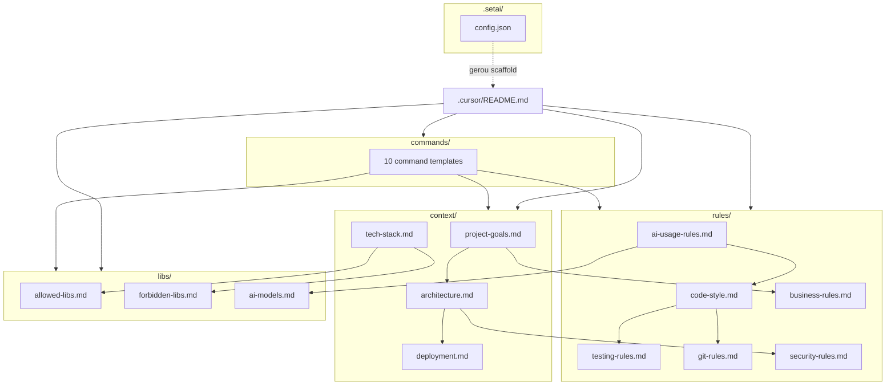

# Relatório de Análise Estrutural — Pasta `.cursor`

**Projeto:** FIAP Tech Challenge 02 — Sistema de Recomendação (MovieLens 20M)  
**Data da análise:** 27 de maio de 2026  
**Escopo:** 27 arquivos em `.cursor/` (100% dos arquivos existentes)  
**Autor da análise:** Arquitetura de software / MLOps (revisão automatizada)

---

## Sumário

1. [Visão geral da arquitetura](#1-visão-geral-da-arquitetura)
2. [Árvore de diretórios](#2-árvore-de-diretórios)
3. [Descrição individual de cada arquivo](#3-descrição-individual-de-cada-arquivo)
4. [Relações entre componentes](#4-relações-entre-componentes)
5. [Análise técnica](#5-análise-técnica)
6. [Aderência ao Tech Challenge](#6-aderência-ao-tech-challenge)
7. [Coerência com MovieLens 20M](#7-coerência-com-movielens-20m)
8. [Contribuição por área MLOps](#8-contribuição-por-área-mlops)
9. [Riscos encontrados](#9-riscos-encontrados)
10. [Arquivos obsoletos ou redundantes](#10-arquivos-obsoletos-ou-redundantes)
11. [Melhorias recomendadas](#11-melhorias-recomendadas)
12. [Conclusão final](#12-conclusão-final)

---

## 1. Visão geral da arquitetura

A pasta `.cursor` é um **framework de governança para desenvolvimento assistido por IA**, gerado principalmente pela ferramenta **SetAI CLI** (evidenciado por `.cursor/.setai/`). Não contém código de ML, pipelines DVC, Dockerfiles nem agents/workflows nativos do Cursor no formato moderno (`.mdc`, `AGENTS.md`, `.github/workflows` dentro de `.cursor`).

### Papel arquitetural

| Camada | Função | Arquivos |
|--------|--------|----------|
| **Meta-documentação** | Índice e princípios de uso | `README.md` |
| **Contexto persistente** | “Como o projeto pensa” | `context/*` (4 arquivos) |
| **Contrato rígido com IA** | Regras obrigatórias | `rules/*` (6 arquivos) |
| **Política de dependências** | Allow/deny list | `libs/*` (3 arquivos) |
| **Prompts reutilizáveis** | Commands do Cursor | `commands/*` (10 arquivos) |
| **Configuração geradora** | SetAI (referência) | `.setai/*` (3 arquivos) |

### O que **não** existe em `.cursor`

- Subpasta `rules/` no formato Cursor Rules (`.mdc` com `globs` / `alwaysApply`)
- Arquivo `AGENTS.md` ou definições de subagentes
- Workflows CI/CD versionados aqui (há menção genérica em `deployment.md`, mas o pipeline real estaria na raiz)
- Templates de código ML (`src/`, `dvc.yaml`, `Dockerfile`)
- Integrações MCP ou hooks Cursor (`hooks.json`)
- Pipelines DVC/MLflow executáveis

### Estado do projeto (contexto externo)

Na raiz do repositório, além de `.cursor/`, existem apenas `TODO.md` e `pdf_extract.txt`. **O código-fonte ML ainda não foi implementado.** A pasta `.cursor` antecipa o domínio (MovieLens, PyTorch, DVC, MLflow) nos arquivos de *context* e *goals*, mas a maior parte dos templates técnicos ainda reflete um **scaffold genérico de aplicação Node.js/CLI**.

---

## 2. Árvore de diretórios

```
.cursor/
├── README.md
├── .setai/
│   ├── .gitignore
│   ├── README.md
│   └── config.json
├── context/
│   ├── architecture.md
│   ├── deployment.md
│   ├── project-goals.md
│   └── tech-stack.md
├── rules/
│   ├── ai-usage-rules.md
│   ├── business-rules.md
│   ├── code-style.md
│   ├── git-rules.md
│   ├── security-rules.md
│   └── testing-rules.md
├── libs/
│   ├── ai-models.md
│   ├── allowed-libs.md
│   └── forbidden-libs.md
└── commands/
    ├── architecture-review.md
    ├── challenge-solution.md
    ├── extract-business-rules.md
    ├── generate-boilerplate.md
    ├── generate-docs.md
    ├── kickoff-project.md
    ├── pre-deploy-validation.md
    ├── refactor-controlled.md
    ├── review-pr.md
    └── test-strategy.md
```

**Total:** 27 arquivos | **Subpastas:** 5 | **Profundidade máxima:** 2 níveis

---

## 3. Descrição individual de cada arquivo

### 3.1 Raiz

#### `README.md`

| Atributo | Detalhe |
|----------|---------|
| **Propósito** | Documentação índice da estrutura `.cursor` |
| **Conteúdo** | Descreve `context/`, `rules/`, `libs/`, `commands/`; fluxo para devs e IA; princípios (“contexto explícito”, “regras duras”, “IA propõe, humanos aprovam”) |
| **Relacionamentos** | Aponta para todos os subdiretórios; não referencia `.setai/` |
| **Observações** | Bem estruturado; em inglês; alinhado com boas práticas de AI-assisted dev 2026 |

---

### 3.2 `.setai/` — Configuração do gerador SetAI

#### `.setai/README.md`

| Atributo | Detalhe |
|----------|---------|
| **Propósito** | Explicar que esta pasta é cópia de referência da config SetAI usada na geração do scaffold |
| **Segurança** | Alerta explícito: não commitar API keys; aponta para `%USERPROFILE%\.setai\config.json` (Windows) |
| **Impacto** | Documentação operacional, não regra de runtime do Cursor |

#### `.setai/config.json`

| Atributo | Detalhe |
|----------|---------|
| **Propósito** | Configuração CLI SetAI: chaves de API (placeholders), idioma |
| **Conteúdo** | `anthropic-key`, `google-key`, `openai-key`; `questions: pt-BR`, `files: en` |
| **Risco** | Se substituído por chaves reais e commitado, vazamento de credenciais |
| **Relacionamentos** | Espelha config global do usuário; independente das rules do Cursor |

#### `.setai/.gitignore`

| Atributo | Detalhe |
|----------|---------|
| **Propósito** | Impedir commit de `config.json` sensível |
| **Observação** | Proteção local; eficácia depende de `.gitignore` na raiz do repo também ignorar `.cursor/.setai/` |

---

### 3.3 `context/` — Contexto persistente do projeto

#### `context/project-goals.md`

| Atributo | Detalhe |
|----------|---------|
| **Propósito** | Alinhamento de negócio antes da implementação |
| **Conteúdo forte** | Problema de recomendação MovieLens 20M; objetivos de engajamento; restrições PyTorch, MLflow, DVC, Docker; non-goals (sem streaming, sem auth, sem microserviços) |
| **Qualidade** | **Melhor arquivo de domínio ML** da pasta `.cursor` |
| **Problema de formatação** | Listas de usuários quebradas em múltiplas linhas com `-` (artefato de export SetAI) |

#### `context/architecture.md`

| Atributo | Detalhe |
|----------|---------|
| **Propósito** | ADR-like: decisões, padrões, limitações |
| **Conteúdo ML** | Descrição do sistema de recomendação e MLOps na seção 1 |
| **Inconsistências graves** | Estilo “Layered + REST + PostgreSQL”; framework **“Nenhum”**; build **npm/pnpm**; padrões **Service/Repository** típicos de API web |
| **Lacunas** | ~70% marcado `[To be defined]`: comunicação, escala, observabilidade, diagramas |
| **Duplicação** | Seções 2 e 9 repetem “Initial Architecture” quase verbatim |

#### `context/tech-stack.md`

| Atributo | Detalhe |
|----------|---------|
| **Propósito** | Stack tecnológica oficial |
| **Declarado** | Python, PostgreSQL, framework “Nenhum”, versão `0.0.1` |
| **Inconsistências** | Runtime Node.js “if applicable”; ESLint, Prettier, TypeScript, Vitest/Jest, Playwright — **zero menção a PyTorch, DVC, MLflow, ruff, pytest, Poetry/uv** |
| **Relacionamentos** | Delega libs para `libs/allowed-libs.md` (que é 100% Node CLI) |

#### `context/deployment.md`

| Atributo | Detalhe |
|----------|---------|
| **Propósito** | Infraestrutura e processo de deploy |
| **Conteúdo real** | Template de **publicação de CLI npm** (`npm version`, `npm publish`, tags beta) |
| **Inconsistências** | Ambientes dev/staging/prod como pacote npm; variável `NODE_ENV`; pipeline com ESLint/Prettier; menção tardia a `pytest` sem integração ML |
| **Para Tech Challenge** | Deveria descrever Docker multi-stage, `docker compose`, MLflow server, DVC remote, não npm publish |

---

### 3.4 `rules/` — Regras obrigatórias (contrato com IA)

#### `rules/code-style.md`

| Atributo | Detalhe |
|----------|---------|
| **Propósito** | Padrões de código obrigatórios |
| **Contexto declarado** | Python, framework “Nenhum”, strict mode false |
| **Conflito central** | Exige **ESLint + Prettier + TypeScript + package.json** como pré-requisito para iniciar desenvolvimento |
| **Regra útil** | Código em inglês; comentários em pt-BR; convenções de naming por linguagem |
| **Para ML** | Deveria exigir **ruff**, **mypy/pyright**, `pyproject.toml`, não ESLint |

#### `rules/testing-rules.md`

| Atributo | Detalhe |
|----------|---------|
| **Propósito** | Estratégia de testes; TDD obrigatório |
| **Pontos fortes** | Pirâmide de testes; ciclo Red-Green-Refactor; cobertura mínima definida (70% geral, 100% business logic) |
| **Problemas** | Exemplos em **TypeScript/Jest**; placeholder `{{TEST_COVERAGE}}` não substituído; ferramentas não citam pytest |
| **Para ML** | Falta orientação sobre testes de pipeline, fixtures de dados sintéticos, smoke test de `dvc repro`, validação de métricas |

#### `rules/git-rules.md`

| Atributo | Detalhe |
|----------|---------|
| **Propósito** | Conventional Commits, branches, PR, merge |
| **Qualidade** | Sólido e aplicável ao projeto acadêmico |
| **Relacionamentos** | Referencia code-style e testing-rules |

#### `rules/security-rules.md`

| Atributo | Detalhe |
|----------|---------|
| **Propósito** | Regras de segurança mandatórias |
| **Conteúdo** | Validação de input, secrets, API, XSS, SQL injection |
| **Inconsistências** | PostgreSQL com **pg (node-postgres) ou Prisma** — irrelevante para stack Python/ML |
| **Para ML** | Falta: não logar PII de ratings, proteger `TMDB_API_KEY`, sanitizar paths em DVC, scanning de modelos pickle |

#### `rules/ai-usage-rules.md`

| Atributo | Detalhe |
|----------|---------|
| **Propósito** | Onde IA pode/não pode atuar; modelos por fase; revisão humana |
| **Pontos fortes** | Proibições claras (segurança, financeiro, deploy prod); “AI propõe, humanos aprovam” |
| **Conflito** | Pré-requisito de ESLint/TypeScript antes de usar IA (desalinhado com Python) |
| **Modelos** | Referências a Claude 4.5, GPT-5.x, Gemini 3 — alinhado com `libs/ai-models.md` |

#### `rules/business-rules.md`

| Atributo | Detalhe |
|----------|---------|
| **Propósito** | Regras de negócio do sistema |
| **Conteúdo ML** | Bloco “Project Context” rico (MovieLens, MLOps) — **copiado** de project-goals |
| **Regras específicas** | Seção “Specific Business Rules” **vazia**; apenas genéricos (validação, erros, edge cases de API) |
| **Para recomendação** | Deveria incluir: cold start, mínimo de interações, top-K, filtro de itens já vistos, métricas NDCG@K/Recall@K |

---

### 3.5 `libs/` — Política de dependências

#### `libs/allowed-libs.md`

| Atributo | Detalhe |
|----------|---------|
| **Propósito** | Whitelist de bibliotecas |
| **Conteúdo real** | **100% ecossistema Node.js CLI**: Commander, Inquirer, fs-extra, Vitest, tsup, pnpm, chalk, Zod |
| **Para Tech Challenge** | **Completamente desalinhado** — deveria listar torch, mlflow, dvc, scikit-learn, pandas, sentence-transformers, bertopic, etc. |

#### `libs/forbidden-libs.md`

| Atributo | Detalhe |
|----------|---------|
| **Propósito** | Blacklist com alternativas |
| **Conteúdo** | Proíbe Yargs, Webpack, Lodash, Axios “porque CLI não faz HTTP” |
| **Ironia** | Projeto precisará de HTTP para TMDB API — regra conflita com `TODO.md` |

#### `libs/ai-models.md`

| Atributo | Detalhe |
|----------|---------|
| **Propósito** | Modelos de IA permitidos por fase de desenvolvimento |
| **Contexto** | Declara Python + Nenhum + PostgreSQL |
| **Conteúdo** | Matriz de modelos (Opus, Sonnet, GPT-5.x, Gemini, Grok) e fases (arquitetura, implementação, debug) |
| **Uso** | Governança de ferramentas Cursor/LLM, não modelos PyTorch |

---

### 3.6 `commands/` — Prompts executáveis (10 templates)

Todos seguem o mesmo **esqueleto**: Objective → Project Context (FIAP TECH 02 + texto MovieLens) → Input → Instructions → Constraints → Output → Related Documentation.

| Arquivo | Propósito | Foco principal |
|---------|-----------|----------------|
| `kickoff-project.md` | Kickoff: requisitos funcionais/não-funcionais, riscos, arquitetura inicial | Planejamento (sem código) |
| `architecture-review.md` | Revisão arquitetural: acoplamento, escalabilidade, trade-offs | Qualidade de design |
| `extract-business-rules.md` | Extrair regras explícitas/implícitas do código | Domínio |
| `test-strategy.md` | Plano de testes por módulo; reforça TDD | QA |
| `generate-boilerplate.md` | Gerar boilerplate seguindo padrões | Implementação mecânica |
| `refactor-controlled.md` | Refatoração sem mudar comportamento | Manutenção |
| `generate-docs.md` | Documentação técnica de módulo | Documentação |
| `review-pr.md` | Code review educativo de PR | Governança |
| `challenge-solution.md` | Questionar solução: riscos, overengineering | Crítica |
| `pre-deploy-validation.md` | Checklist pré-deploy: negócio, segurança, observabilidade | Release |

**Observações transversais aos commands:**

- Repetem o mesmo bloco de descrição MovieLens (~15 linhas) em cada arquivo → **duplicação massiva**
- Stack sempre `Python + Nenhum + PostgreSQL` — não menciona DVC/MLflow/Docker nos headers
- Nenhum command específico para: pipeline DVC, experimento MLflow, treino PyTorch, feature engineering BERTopic
- `challenge-solution.md` é o único que cita restrições técnicas completas do Tech Challenge no header

---

## 4. Relações entre componentes

### 4.1 Diagrama de dependências conceituais



### 4.2 Fluxo recomendado de leitura (para IA ou dev)

```
1. rules/*          → contrato rígido
2. context/*        → entendimento do domínio
3. libs/*           → dependências permitidas
4. commands/*       → ação pontual
5. TODO.md (raiz)   → plano de execução real (fora de .cursor)
```

### 4.3 Matriz de referências cruzadas

| Origem | Referencia frequentemente |
|--------|---------------------------|
| `README.md` | Todos os subdirs (exceto `.setai`) |
| `context/architecture.md` | tech-stack, project-goals, deployment, security, business-rules |
| `rules/*` | Entre si + context |
| `commands/*` | context + rules + libs |
| `libs/*` | tech-stack, code-style |
| `project-goals.md` | architecture, business-rules |
| **Nenhum arquivo** | `TODO.md`, `pdf_extract.txt`, pipelines ML reais |

### 4.4 Hierarquia de autoridade (conflitos)

Quando há conflito, a IA do Cursor tende a priorizar:

1. **User rules** (globais do Cursor IDE) — ex.: responder em pt-BR
2. **`rules/`** — declaradas como “hard rules”
3. **`context/`** — podem contradizer rules em stack
4. **`libs/`** — contradiz context de Python ML
5. **`commands/`** — escopo pontual da tarefa

**Conflito atual:** `rules/code-style` + `libs/allowed-libs` mandam stack Node; `context/project-goals` + `TODO.md` mandam stack Python/MLOps.

---

## 5. Análise técnica

### 5.1 Pontos fortes

| Área | Avaliação |
|------|-----------|
| **Organização** | Separação clara context / rules / libs / commands — padrão maduro de AI governance |
| **Domínio de negócio** | `project-goals.md`, trechos em `business-rules.md` e headers dos commands descrevem bem MovieLens + MLOps |
| **Governança de IA** | `ai-usage-rules.md` e `ai-models.md` são detalhados e profissionais |
| **Git/PR** | `git-rules.md` e `review-pr.md` aplicáveis imediatamente |
| **Princípios** | TDD, conventional commits, revisão humana — alinhados com engenharia de qualidade |
| **SetAI** | `.gitignore` em `.setai/` mitiga risco de commit de secrets |

### 5.2 Fragilidades estruturais

| Problema | Severidade | Detalhe |
|----------|------------|---------|
| **Template mismatch** | Crítica | Scaffold SetAI para CLI Node.js aplicado a projeto Python/ML |
| **Placeholder “Nenhum”** | Alta | Framework “Nenhum” aparece 15+ vezes — valor inválido do wizard SetAI |
| **`[To be defined]`** | Média | architecture.md e security.md incompletos |
| **Duplicação textual** | Média | Mesmo parágrafo MovieLens em 15+ arquivos |
| **`{{TEST_COVERAGE}}`** | Baixa | Template não renderizado em testing-rules |
| **Listas quebradas** | Baixa | Bullets de usuários fragmentados em linhas separadas |
| **Ausência de rules Cursor nativas** | Média | Arquivos `.md` em subpastas podem não ser auto-aplicados sem configuração adicional no Cursor |

### 5.3 Automations, agents e workflows

| Recurso esperado | Presente? |
|------------------|-----------|
| Cursor Rules (`.mdc`) | Não |
| Agents (`AGENTS.md`) | Não |
| Hooks | Não |
| Workflows GitHub em `.cursor` | Não |
| Pipelines DVC | Não (planejado em `TODO.md`) |
| Integrações MCP | Fora de `.cursor` (config do usuário) |

Os **commands** são a única forma de “workflow” — prompts manuais invocados pelo usuário no chat.

### 5.4 Padrões arquiteturais documentados vs necessários

| Documentado em `.cursor` | Necessário para Tech Challenge |
|--------------------------|-------------------------------|
| Layered + REST + Repository | Pipeline ML em camadas: data → features → train → serve |
| PostgreSQL como SoT | Parquet/DVC + artefatos MLflow como SoT de experimentos |
| Stateless API | Scripts CLI / FastAPI opcional para inferência |
| Service Pattern | Factory (modelos), Strategy (preprocessadores) — citado em `TODO.md`, ausente em `.cursor` |

---

## 6. Aderência ao Tech Challenge

Referência: `TODO.md` na raiz (plano oficial do grupo).

| Critério (peso) | Cobertura em `.cursor` | Gap |
|-----------------|------------------------|-----|
| **Clean Code + SOLID (15%)** | Parcial — princípios genéricos em rules | Sem ruff, sem limite 20 linhas, sem Factory/Strategy |
| **Reprodutibilidade Poetry/uv (15%)** | Mencionado em project-goals | tech-stack não cita Poetry/uv |
| **Docker multi-stage (15%)** | Mencionado em goals/constraints | deployment.md fala npm, não Docker |
| **DVC pipeline ≥3 stages (15%)** | Mencionado em goals | Nenhum command/rule para stages DVC |
| **PyTorch rede neural (15%)** | Mencionado em goals | allowed-libs sem torch |
| **MLflow + Registry (10%)** | Mencionado em goals | Sem regras de logging/registro |
| **≥4 métricas, baselines sklearn** | Ausente | — |
| **BERTopic em feature_eng** | Ausente em `.cursor` | Presente só em `TODO.md` |
| **Vídeo STAR** | Ausente | — |
| **Type hints + docstrings Google** | Parcial em code-style | Conflito com TypeScript obrigatório |

### Score qualitativo de aderência

| Dimensão | Nota (0–10) | Comentário |
|----------|-------------|------------|
| Intenção / visão de negócio | **8** | project-goals e constraints estão corretos |
| Stack técnica documentada | **2** | tech-stack e libs descrevem Node, não Python ML |
| MLOps operacional | **3** | Menções textuais sem procedimentos |
| Testes para ML | **4** | TDD genérico, sem testes de dados/modelo |
| Deploy/reprodutibilidade | **2** | deployment.md é template npm |
| Governança de IA | **8** | ai-usage-rules e ai-models sólidos |
| **Média ponderada** | **~4,5** | Forte em processo IA, fraco em stack real |

---

## 7. Coerência com MovieLens 20M

### 7.1 O que está coerente

- Problema de recomendação colaborativa + conteúdo
- Dataset MovieLens 20M explicitamente nomeado
- Reprodutibilidade, DVC, MLflow, Docker como objetivos
- Non-goals realistas (sem streaming, sem auth obrigatória)
- Analogia e-commerce possível (mencionada no `TODO.md`, não no `.cursor`)

### 7.2 O que está incoerente

| Aspecto MovieLens / ML | Estado em `.cursor` |
|------------------------|---------------------|
| Arquivos `ratings.csv`, `movies.csv`, `tags.csv`, `links.csv` | Não referenciados |
| Pipeline `preprocess → enrich_metadata → feature_eng → train → evaluate` | Só em `TODO.md` |
| TMDB API / metadados | Proibido HTTP em forbidden-libs (CLI) |
| BERTopic | Ausente |
| Métricas NDCG@K, Recall@K | Ausente em business-rules |
| PostgreSQL | Declarado mas não justificado para recomendação batch |
| REST API como centro | Arquitetura web, não batch ML |

### 7.3 Veredito de coerência

A **narrativa de alto nível** (goals + constraints nos commands) é coerente com MovieLens 20M. A **arquitetura técnica detalhada** (architecture, tech-stack, libs, deployment, code-style) é **incoerente** — ainda descreve um produto de software web/CLI, não um sistema de recomendação MLOps.

---

## 8. Contribuição por área MLOps

| Área | Arquivos que ajudam | Efetividade atual |
|------|---------------------|-------------------|
| **Treinamento** | project-goals (menciona PyTorch) | Baixa — sem estrutura `src/training` |
| **Experiment tracking** | project-goals, challenge-solution | Baixa — sem convenções MLflow |
| **Pipelines** | project-goals (DVC mencionado) | Nenhuma — sem dvc.yaml nem stages |
| **Versionamento** | project-goals, git-rules | Média para código; nada para dados/modelos |
| **Deploy** | deployment.md, pre-deploy-validation | Contraproducente (template npm) |
| **Automação** | commands (review, refactor, docs) | Média para engenharia; zero para ML |
| **Organização** | README, estrutura de pastas `.cursor` | Alta para governança IA |

---

## 9. Riscos encontrados

| ID | Risco | Probabilidade | Impacto | Mitigação sugerida |
|----|-------|---------------|---------|-------------------|
| R1 | IA gera código Node/TS por causa de allowed-libs e code-style | Alta | Alto | Reescrever libs/ e code-style para Python |
| R2 | IA exige ESLint antes de codar — bloqueio falso | Alta | Médio | Substituir por ruff + pre-commit |
| R3 | Commit acidental de API keys em `.setai/config.json` | Média | Crítico | Adicionar `.cursor/.setai/` ao `.gitignore` raiz |
| R4 | Duplicação de contexto → respostas longas e contraditórias | Alta | Médio | Centralizar domínio em 1 arquivo; commands referenciam |
| R5 | architecture.md REST/PostgreSQL desvia do pipeline batch | Alta | Alto | Reescrever architecture para ML pipeline |
| R6 | TDD 100% business logic com projeto ainda vazio | Média | Baixo | Priorizar testes de contrato de dados primeiro |
| R7 | forbidden-libs bloqueia HTTP — conflito com TMDB | Média | Médio | Permitir `httpx`/`requests` com cache DVC |
| R8 | Rules `.md` não aplicadas automaticamente no Cursor | Média | Médio | Migrar para `.cursor/rules/*.mdc` com globs |
| R9 | Placeholder `Nenhum` confunde escolha de framework | Alta | Baixo | Definir FastAPI ou “CLI + scripts” explicitamente |
| R10 | Divergência `.cursor` vs `TODO.md` — fonte da verdade dupla | Alta | Alto | `TODO.md` ou novo `context/ml-pipeline.md` prevalece |

---

## 10. Arquivos obsoletos ou redundantes

### 10.1 Potencialmente obsoletos (para este projeto)

| Arquivo | Motivo |
|---------|--------|
| `libs/allowed-libs.md` (conteúdo atual) | 100% Node CLI — não serve projeto Python |
| `libs/forbidden-libs.md` (conteúdo atual) | Regras de CLI npm |
| `context/deployment.md` (conteúdo atual) | Fluxo npm publish |
| Trechos ESLint/TypeScript em `code-style.md`, `ai-usage-rules.md` | Stack errada |

### 10.2 Redundantes (manter um, referenciar nos outros)

| Conteúdo duplicado | Onde aparece |
|--------------------|--------------|
| Descrição MovieLens + MLOps | project-goals, business-rules, architecture §1, 10× commands |
| Restrições técnicas PyTorch/DVC/MLflow | project-goals, business-rules, challenge-solution |
| “Initial Architecture” | architecture.md §2 e §9 |
| TDD obrigatório | testing-rules, test-strategy, review-pr, code-style |

### 10.3 Necessários (manter e evoluir)

| Arquivo | Motivo |
|---------|--------|
| `README.md` | Índice |
| `project-goals.md` | Melhor fonte de domínio |
| `git-rules.md` | Aplicável imediatamente |
| `ai-usage-rules.md` + `ai-models.md` | Governança LLM |
| Commands `architecture-review`, `challenge-solution`, `review-pr` | Úteis com contexto corrigido |

### 10.4 `.setai/` — manter ou remover?

| Opção | Prós | Contras |
|-------|------|---------|
| **Manter local, gitignore na raiz** | Rastreabilidade de como o scaffold foi gerado | Confusão se commitado |
| **Remover do repo** | Menor risco de secrets | Perde histórico do gerador |

**Recomendação:** manter apenas `.setai/README.md` no repo; `config.json` apenas no `.gitignore` raiz.

---

## 11. Melhorias recomendadas

### 11.1 Prioridade P0 (antes de codar ML)

1. **Reescrever `context/tech-stack.md`** com: Python 3.11+, Poetry/uv, PyTorch, scikit-learn, MLflow, DVC, pandas, ruff, pytest, Docker, BERTopic/sentence-transformers (opcional).
2. **Substituir `libs/allowed-libs.md` e `forbidden-libs.md`** por política Python/ML (versões pinadas, proibir tensorflow se padronizar torch, etc.).
3. **Atualizar `rules/code-style.md`**: ruff, mypy, pyproject.toml, docstrings Google; remover ESLint/Prettier obrigatórios.
4. **Reescrever `context/deployment.md`**: Docker multi-stage, docker-compose (app + mlflow), `dvc repro`, variáveis `.env` (DVC remote, TMDB_API_KEY).
5. **Reescrever `context/architecture.md`**: pipeline em camadas ML (`data/`, `features/`, `models/`, `training/`, `serving/`), Factory/Strategy, diagrama Mermaid do fluxo MovieLens.
6. **Adicionar ao `.gitignore` raiz**: `.cursor/.setai/config.json`, `mlruns/`, `data/raw/`, `.env`.

### 11.2 Prioridade P1 (durante implementação)

7. **Criar `context/ml-pipeline.md`**: stages DVC, artefatos, métricas, ablation MLflow (copiar de `TODO.md`).
8. **Preencher `rules/business-rules.md`**: cold start, top-K, split temporal, leakage, métricas mínimas.
9. **Criar commands novos**:
   - `dvc-pipeline-review.md`
   - `mlflow-experiment-design.md`
   - `recommendation-metrics.md`
   - `model-card-draft.md`
10. **Migrar rules para formato Cursor**: `.cursor/rules/python-ml.mdc` com `alwaysApply: true` e globs `src/**/*.py`.
11. **Deduplicar commands**: `Project Context` → link para `context/project-goals.md` apenas.

### 11.3 Prioridade P2 (maturidade)

12. **AGENTS.md** na raiz com papéis: Data Engineer, ML Engineer, MLOps, Reviewer.
13. **Alinhar `testing-rules.md`**: exemplos pytest; testes de propriedades em splits; smoke `dvc repro`.
14. **Atualizar `security-rules.md`**: secrets ML, pickle safety, API rate limit TMDB.
15. **Remover placeholders**: `Nenhum`, `{{TEST_COVERAGE}}`, `[To be defined]` ou preencher.

### 11.4 Estrutura alvo sugerida (`.cursor` evoluído)

```
.cursor/
├── README.md
├── rules/
│   ├── python-ml.mdc          # alwaysApply
│   ├── mlops-dvc-mlflow.mdc   # globs: dvc.yaml, **/params.yaml
│   ├── git.mdc
│   └── ai-governance.mdc
├── context/
│   ├── project-goals.md
│   ├── ml-architecture.md     # substitui architecture genérica
│   ├── ml-pipeline.md
│   ├── tech-stack.md          # Python/ML
│   └── deployment.md          # Docker/DVC/MLflow
├── commands/
│   └── ... (existentes + 4 ML)
└── libs/
    ├── allowed-python.md
    └── forbidden-python.md
```

---

## 12. Conclusão final

A pasta `.cursor` do **Tech Challenge 02** é um **esqueleto de governança para desenvolvimento com IA bem organizado**, gerado pelo **SetAI**, com **visão de negócio e restrições do desafio corretamente capturadas** em `project-goals.md` e nos headers dos commands. Porém, a **camada técnica operacional permanece um template genérico de aplicação Node.js/CLI publicada no npm**, em **conflito direto** com os requisitos de Python, PyTorch, DVC, MLflow, Docker e pipeline de recomendação MovieLens 20M descritos em `TODO.md`.

**Resumo executivo:**

| Aspecto | Status |
|---------|--------|
| Cobertura de arquivos analisados | 27/27 (100%) |
| Pronto para guiar implementação ML | **Não** — requer P0 acima |
| Pronto para governança Git/PR/IA | **Parcialmente sim** |
| Coerente com MovieLens 20M (visão) | **Sim** (texto de alto nível) |
| Coerente com MovieLens 20M (stack) | **Não** |
| Risco principal | IA seguir libs/rules Node e desviar do Tech Challenge |

**Próximo passo recomendado para o time:** executar o bloco P0 (reescrever tech-stack, libs, code-style, deployment, architecture) em uma única PR de documentação, usando `TODO.md` como fonte da verdade técnica, antes de gerar qualquer código com os commands atuais do Cursor.

---

*Relatório gerado por análise estática completa de todos os arquivos em `.cursor/` e cruzamento com `TODO.md` na raiz do repositório.*
