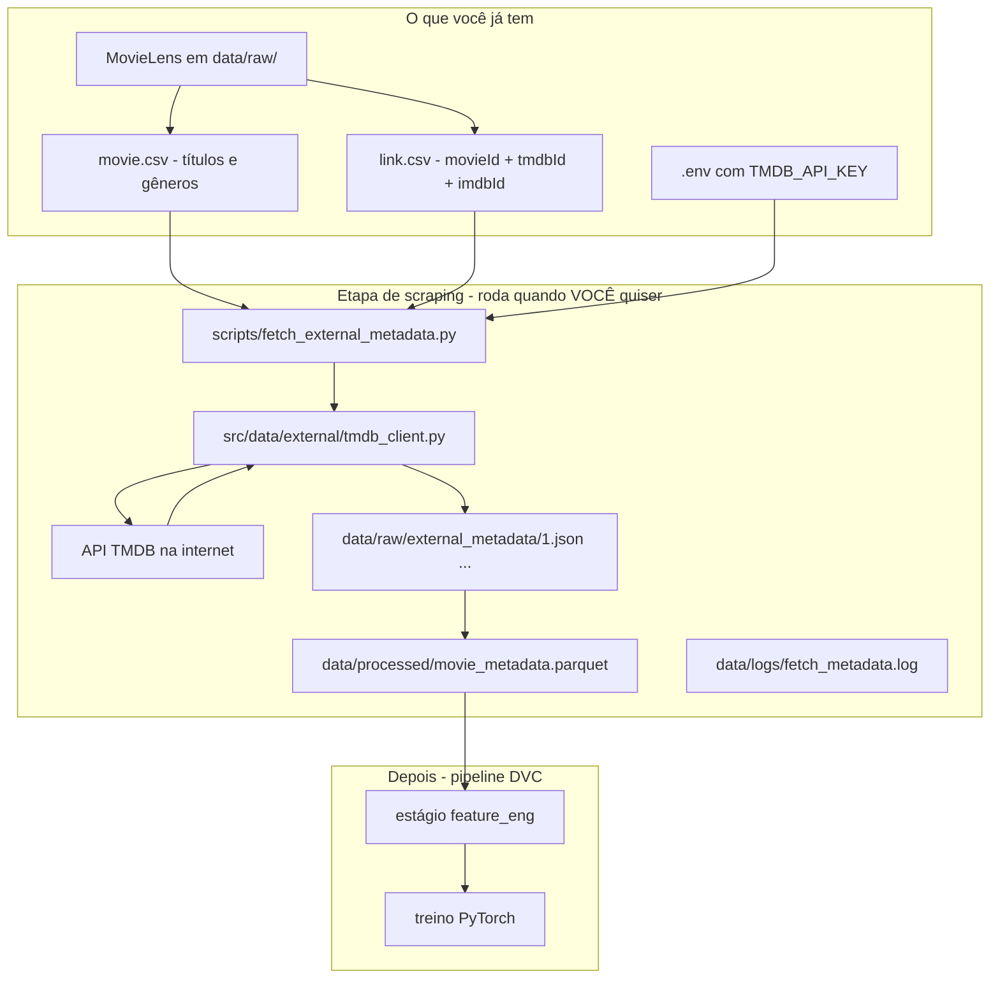

# Fluxo de coleta de metadados (TMDB) — explicação para o time

> **Para quem está começando:** este texto explica *de ponta a ponta* como enriquecemos os filmes do MovieLens com informações extras (sinopse, gêneros, palavras-chave) usando a **API do TMDB**.  
> **Importante:** não é “scraping” de site (copiar HTML do IMDb). É **chamada oficial à API**, com chave, limites de uso e cache local.

---

## 1. Por que fazemos isso?

O **MovieLens** já traz:

- quem avaliou o quê (`ratings`)
- título e gêneros (`movies`)
- tags de usuários (`tags`)

Isso é ótimo para **colaborativo** (“quem gostou de X também gostou de Y”), mas fraco para:

- filme com **poucas avaliações** (cauda longa)
- filme **novo** no catálogo (cold start)

O **TMDB** (The Movie Database) tem ficha rica: **sinopse (`overview`)**, gêneros, keywords, ano, idioma.  
Juntando os dois, o modelo fica **híbrido**: comportamento dos usuários + conteúdo do filme.

**Analogia e-commerce (do desafio):**  
`movieId` = SKU do produto · `overview` = descrição do produto na ficha do fornecedor.

---

## 2. Visão geral em uma frase

> Baixamos o MovieLens → lemos o `tmdbId` de cada filme → perguntamos **uma vez** ao TMDB → guardamos em arquivos locais → o treino **só lê esses arquivos**, sem internet.

---

## 3. Diagrama do fluxo



---

## 4. Passo a passo (linguagem simples)

### Passo A — Preparar o terreno (já feito nos Blocos 0–1)

| O quê | Onde |
|-------|------|
| Pastas do projeto | `src/`, `data/`, `scripts/` |
| Chave da API | arquivo `.env` (copiado do `.env.example`) |
| CSV do MovieLens | `data/raw/movie.csv`, `data/raw/link.csv` |

Sem chave no `.env`, o script para e avisa.

---

### Passo B — O script lê o MovieLens

O programa abre:

1. **`movie.csv`** — título e gêneros de cada `movieId`
2. **`link.csv`** — para cada filme, o **`tmdbId`** (ID no TMDB)

Ele **junta** as duas tabelas numa lista única de filmes a enriquecer.

Se faltar `tmdbId`, o filme é marcado como `missing_tmdb_id` (não chama a API à toa).

---

### Passo C — Pergunta ao TMDB (não é scraping)

Para cada `tmdbId` válido, o **cliente** (`tmdb_client.py`):

1. Monta um link do tipo: “me dê os detalhes do filme 862”
2. Envia com sua **API key**
3. Espera um intervalo entre chamadas (**rate limit**) para não ser bloqueado
4. Se der erro temporário (429, 503), **tenta de novo** com espera crescente (**backoff**)
5. Registra problemas em **`data/logs/fetch_metadata.log`**

**O que volta da API (resumo):**

| Campo TMDB | Vira no nosso parquet | Uso didático |
|------------|------------------------|--------------|
| `overview` | `overview` | **Sinopse / resumo do filme** |
| `genres` | `genres` | Gêneros em texto |
| `keywords` | `keywords` | Palavras-chave |
| `release_date` | `release_year` | Ano |
| `original_language` | `original_language` | Idioma |
| `vote_average`, `popularity` | mesmos nomes | Sinal de “qualidade” (cuidado com vazamento temporal no treino) |

---

### Passo D — Guardar em dois níveis (cache)

#### 1) Cache “cru” — um JSON por filme

**Pasta:** `data/raw/external_metadata/`  
**Arquivo:** `{movieId}.json` (ex.: `1.json`, `2.json`)

Cada arquivo guarda:

- campos já organizados (`overview`, `genres`, …)
- status (`ok`, `not_found`, …)
- opcionalmente o JSON bruto do TMDB (`tmdb_raw`) para auditoria

**Por quê?** Se o script cair no meio, você roda de novo com `--resume` e ele **pula** o que já baixou.

#### 2) Tabela consolidada — um parquet para o pipeline

**Arquivo:** `data/processed/movie_metadata.parquet`

Uma **planilha binária** (Parquet): **uma linha por filme**, todas as colunas alinhadas.  
É isso que o DVC / `feature_eng` vão ler depois.

---

### Passo E — O treino NÃO chama a API de novo

Regra de ouro do projeto:

| Momento | Chama TMDB? |
|---------|-------------|
| `python scripts/fetch_external_metadata.py` | **Sim** (você decide quando) |
| `dvc repro` / treino / avaliação | **Não** — só lê parquet e cache |

Assim o experimento é **reprodutível**: mesmo dado, mesma máquina, mesmo resultado.

---

## 5. Onde fica o “resumo do filme”?

| Pergunta | Resposta |
|----------|----------|
| Onde é coletado? | Campo `overview` da API TMDB |
| Onde fica guardado? | Coluna **`overview`** em `movie_metadata.parquet` |
| Onde aparece no cache? | Dentro de cada `data/raw/external_metadata/{movieId}.json` |
| Onde o modelo usa? | Ainda **não no treino direto** — no estágio **`feature_eng`** (Bloco 4), o texto vira **números** (embeddings, tópicos BERTopic) e o PyTorch usa esses números |

O modelo **não lê parágrafo de sinopse**; lê **vetores** gerados a partir da sinopse.

---

## 6. Comandos que o aluno precisa saber

Na **raiz do projeto** (onde está o `TODO.md`):

```bash
# Ativar o ambiente com o comando adequado ao seu sistema operacional
# Consulte o README para exemplos cross-platform

# Testar com 3 filmes
python scripts/fetch_external_metadata.py --limit 3

# Coleta completa (~27 mil filmes, demora horas)
python scripts/fetch_external_metadata.py --resume
```

| Flag | Significado |
|------|-------------|
| `--limit 3` | Só os 3 primeiros (teste) |
| `--resume` | Continua de onde parou, usando JSON já salvos |

---

## 7. Como saber se deu certo?

1. **Console:** mensagem `wrote ... movie_metadata.parquet rows=... ok=...`
2. **Arquivos:** existem JSON em `data/raw/external_metadata/`
3. **Parquet:** abrir `movie_metadata.parquet` (Pandas, DuckDB, etc.) e ver coluna `overview` preenchida
4. **Log:** `data/logs/fetch_metadata.log` para erros e filmes não encontrados

Coluna **`fetch_status`**:

| Valor | Significado |
|-------|-------------|
| `ok` | TMDB respondeu com sucesso |
| `missing_tmdb_id` | Sem ID TMDB no `link.csv` |
| `not_found` | TMDB não achou aquele ID |

---

## 8. Erros comuns (FAQ rápido)

**“É scraping do IMDb?”**  
Não. IMDb não entra aqui como site copiado. Usamos **API TMDB** com `tmdbId` do `link.csv`.

**“Preciso rodar a coleta todo dia?”**  
Não. Uma vez (ou quando quiser atualizar metadados). Depois só o parquet.

**“Posso commitar os JSON e o parquet no Git?”**  
Não os CSV brutos do MovieLens nem arquivos gigantes. O projeto usa **`.gitignore`** + depois **DVC** para versionar artefatos grandes.

**“OMDb no `.env`?”**  
Opcional. O fluxo atual é **só TMDB**. OMDb seria plano B (outro provedor).

---

## 9. Ligação com o resto do Tech Challenge

| Fase do PDF / TODO | Relação com esta coleta |
|--------------------|-------------------------|
| Etapa de scraping P.4–P.7 | Este fluxo inteiro |
| Bloco 4 — `feature_eng` | Lê `movie_metadata.parquet` + tags MovieLens |
| Bloco 5 — PyTorch | Modelo híbrido (colaborativo + features de conteúdo) |
| MLflow — ablação 4 | Experimento “+ metadados TMDB” vs só colaborativo |

---

## 10. Arquivos de código relacionados

| Arquivo | Papel em uma linha |
|---------|-------------------|
| `scripts/fetch_external_metadata.py` | Botão “start” que o aluno executa |
| `src/data/external/tmdb_client.py` | Fala com o TMDB com educação (limite, retry) |
| `src/data/external/metadata_fetch.py` | Loop nos filmes, salva JSON e parquet |
| `src/data/external/movielens_io.py` | Abre `movie.csv` / `link.csv` |
| `configs/settings.py` | Lê `TMDB_API_KEY` do `.env` |
| `docs/PRE_ETAPA_METADADOS.md` | Comandos e variáveis (referência técnica curta) |

---

## 11. Resumo final (cola no caderno)

1. MovieLens diz **qual filme** (`movieId`) e **qual ID no TMDB** (`tmdbId`).  
2. O script baixa **sinopse e metadados** da API TMDB **uma vez**.  
3. Salva em **JSON por filme** + **um parquet** com coluna `overview`.  
4. O **treino** só usa o parquet — **sem internet**.  
5. O **resumo** vira feature numérica no `feature_eng`, não texto cru no PyTorch.

---

*Documento alinhado ao `TODO.md` (etapa de scraping) e a [GUIA_SCRAPING_E_PIPELINE.md](GUIA_SCRAPING_E_PIPELINE.md).*
