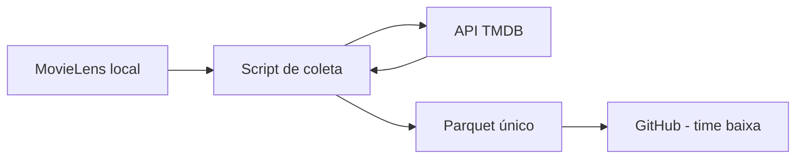
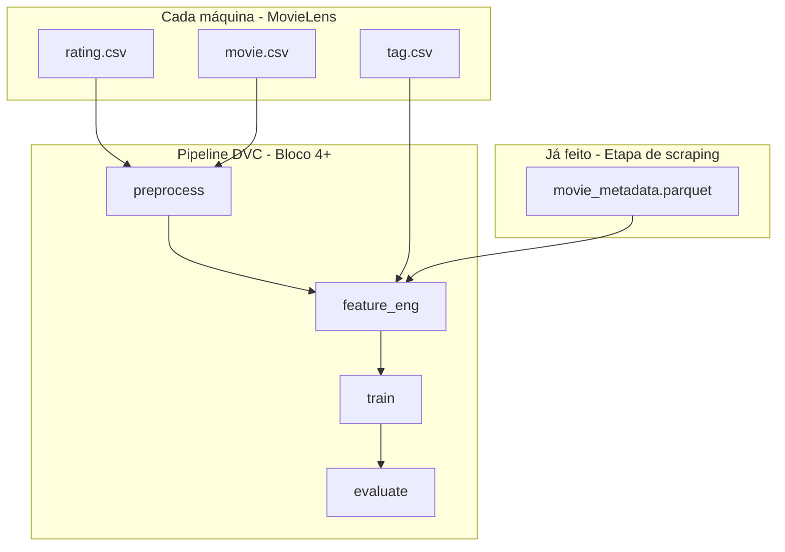

# Guia para leigos — Etapa de scraping e uso no pipeline

> **Público:** quem não programa ou está entrando no projeto agora.  
> **Objetivo:** entender o que foi feito na **etapa de scraping** (coleta TMDB) e **como esses dados entram no treino** depois.

**Documentos relacionados**

| Documento | Conteúdo |
|-----------|----------|
| [FLUXO_COLETA_METADADOS.md](FLUXO_COLETA_METADADOS.md) | Passo a passo técnico da coleta |
| [PRE_ETAPA_METADADOS.md](PRE_ETAPA_METADADOS.md) | Comandos, status e checklist da etapa |
| [METADATA_COVERAGE_REPORT.md](METADATA_COVERAGE_REPORT.md) | Números de cobertura (P.8) |
| [METADATA_VALIDATION_SAMPLE.md](METADATA_VALIDATION_SAMPLE.md) | Amostra de 10 filmes para conferência manual |

---

## 1. O que é a “etapa de scraping” neste projeto?

No plano do time chamamos de **etapa de scraping** a fase em que **enriquecemos cada filme** do MovieLens com informações do **TMDB** (The Movie Database).

**Importante:** não copiamos páginas do IMDb no navegador. Usamos a **API oficial** do TMDB (com chave `TMDB_API_KEY`), que é o jeito permitido e estável.

**Analogia (desafio e-commerce):**

| MovieLens | Significado no desafio |
|-----------|-------------------------|
| `movieId` | Código do produto (SKU) |
| Título e gêneros em `movie.csv` | Ficha básica do catálogo |
| Sinopse vinda do TMDB (`overview`) | Descrição rica do produto no fornecedor |

---

## 2. O que já foi feito (resumo)

A equipe executou a coleta **uma vez** para ~27 mil filmes. Resultado:

| Resultado | Onde está |
|---------|-----------|
| **Tabela consolidada** (principal) | `data/processed/movie_metadata.parquet` |
| Cache por filme (opcional, local) | `data/raw/external_metadata/{movieId}.json` |
| Log de execução | `data/logs/fetch_metadata.log` |

### Números da coleta (referência)

| Situação | Quantidade | Significado |
|----------|------------|-------------|
| **ok** | 26.717 | TMDB respondeu; temos sinopse/metadados |
| not_found | 309 | ID TMDB no MovieLens não existe mais no TMDB |
| missing_tmdb_id | 252 | Filme sem ID TMDB no `link.csv` |
| **Total de filmes** | 27.278 | Tamanho do catálogo MovieLens usado |

Entre os filmes `ok`, quase todos têm **sinopse** (~100%) e **gêneros** (~99,7%); **keywords** aparecem em ~86%.

---

## 3. Como a coleta funcionou (sem jargão)



1. **Entrada:** arquivos do MovieLens em `data/raw/` (`movie.csv`, `link.csv`).
2. **Para cada filme:** o script lê o `tmdbId` e pergunta ao TMDB: título, sinopse, gêneros, palavras-chave, ano, etc.
3. **Saída principal:** um único arquivo **`movie_metadata.parquet`** — uma “planilha” com uma linha por filme.
4. **Compartilhamento:** o parquet foi liberado no **Git** para os colegas **não precisarem rodar a coleta de novo** (`git pull`).

**Regra de ouro:** o treino e o pipeline **não abrem a internet** de novo para o TMDB. Eles só leem o parquet.

---

## 4. O que é o arquivo Parquet?

O **Parquet** é um formato de arquivo para guardar tabelas grandes de forma compacta.

| Pergunta | Resposta simples |
|----------|------------------|
| É o mesmo que Excel/CSV? | Parecido (linhas e colunas), mas otimizado para máquina |
| O que tem dentro? | Uma linha por filme, colunas como sinopse, gêneros, keywords |
| Por que não 27 mil CSV? | Um arquivo só (~7 MB) é mais simples para o pipeline e para o Git |
| Preciso abrir manualmente? | Não; o código Python lê no estágio de features |

**Colunas principais**

| Coluna | O que é |
|--------|---------|
| `movie_id` | Mesmo `movieId` do MovieLens — **chave para juntar tudo** |
| `overview` | Sinopse / resumo do filme |
| `genres` | Gêneros (texto) |
| `keywords` | Palavras-chave do TMDB |
| `release_year` | Ano |
| `fetch_status` | `ok`, `not_found`, `missing_tmdb_id`, etc. |

---

## 5. O que vai para o GitHub e o que não vai

| Item | Vai no Git? | Motivo |
|------|-------------|--------|
| `movie_metadata.parquet` | **Sim** | Time usa sem refazer coleta |
| JSON em `external_metadata/` | **Não** | Só cache local; parquet já basta |
| CSV do MovieLens (ratings, etc.) | **Não** | Muito grande; cada um baixa do Kaggle |
| `.env` com chave TMDB | **Não** | Segredo |

**No dia a dia do colega:** `git clone` / `git pull` → já recebe o parquet → baixa MovieLens localmente → segue o pipeline.

---

## 6. Como isso será usado no pipeline (futuro)

Hoje a etapa de scraping está **concluída**. O próximo trabalho é o **pipeline de ML** (DVC + treino), que **consome** o parquet — não refaz a coleta.



### O que cada estágio faz (visão leiga)

| Estágio | O que faz | Usa o parquet? |
|---------|-----------|----------------|
| **preprocess** | Limpa avaliações, define treino/teste no tempo | Indiretamente (mesmos `movieId`) |
| **feature_eng** | Monta features: quem gostou do quê + texto/gêneros do TMDB | **Sim — merge aqui** |
| **train** | Treina rede PyTorch e baselines | Usa features já prontas |
| **evaluate** | Mede Recall@K, NDCG@K, etc. | Não chama TMDB |

### O “merge” explicado em uma frase

> Juntamos **quem avaliou o quê** (MovieLens) com **a ficha rica do filme** (parquet TMDB) usando o mesmo código de filme: **`movieId` = `movie_id`**.

O modelo **não lê** o parágrafo da sinopse diretamente no treino. O estágio `feature_eng` transforma texto em **números** (embeddings, tópicos BERTopic, etc.) e o PyTorch usa esses números junto com o comportamento dos usuários.

---

## 7. Experimentos previstos (MLflow)

O desafio pede comparar versões do modelo. Exemplo de linha do tempo:

| Experimento | O que usa |
|-------------|-----------|
| 1. Só colaborativo | Ratings (quem gostou do quê) |
| 2. + tags MovieLens | Tags dos usuários |
| 3. + BERTopic | Tópicos a partir de texto (tags / sinopse) |
| 4. + metadados TMDB | Features do **parquet** (sinopse, keywords, gêneros TMDB) |

A etapa de scraping alimenta principalmente o **experimento 4** e melhora cold start de filmes com poucas avaliações.

---

## 8. Perguntas frequentes

**Preciso rodar o script de coleta?**  
Não, se você fez `git pull` e tem `data/processed/movie_metadata.parquet`. Só rode de novo se for **atualizar** metadados ou refazer a etapa.

**E se meu filme tiver `not_found`?**  
O pipeline usa só o que o MovieLens já tem (título, gêneros, tags). O filme não some do dataset.

**O TMDB será chamado no `dvc repro`?**  
**Não.** Isso é requisito de reprodutibilidade do projeto.

**JSON na pasta `external_metadata` é obrigatório?**  
Não para o time. Serve para `--resume` se alguém continuar a coleta localmente.

**DVC vs Git no parquet?**  
Hoje o parquet está no **Git** para facilitar o grupo. No **Bloco 4** vocês podem migrar para **DVC** (versionamento MLOps profissional); ver [README](../README.md).

---

## 9. Comandos úteis (referência rápida)

```bash
# Coleta completa (só quem for refazer)
python scripts/fetch_external_metadata.py --resume

# Relatório de cobertura
python scripts/metadata_coverage_report.py

# Amostra para validação manual
python scripts/metadata_validation_sample.py
```

---

## 10. Linha do tempo do projeto

| Fase | Status |
|------|--------|
| Blocos 0–1 — estrutura e clean code | Concluído |
| **Etapa de scraping** — parquet TMDB | **Concluído** |
| Bloco 2 — dependências (torch, mlflow, dvc) | Próximo |
| Bloco 3 — EDA MovieLens | Em seguida |
| Bloco 4 — pipeline + merge no `feature_eng` | Onde o parquet entra no ML |
| Blocos 5–6 — modelo, MLflow, entrega STAR | Final |

---

*Última atualização alinhada ao `TODO.md` e ao resultado da coleta (26.717 filmes `ok`).*
